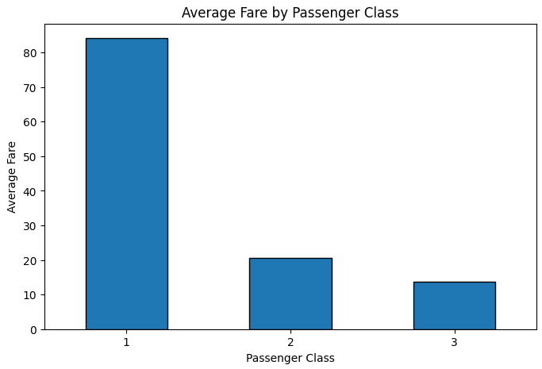

# Titanic Exploratory Data Analysis using Microsoft Azure Machine Learning




## Project Overview

This project presents a complete **Exploratory Data Analysis (EDA)** of the Titanic dataset using **Python** in **Microsoft Azure Machine Learning Notebooks**.

The objective of this project is to explore the dataset, assess its quality, understand the relationships between variables, and identify key insights before developing machine learning models.

---

## Objectives

- Explore the structure of the dataset
- Assess data quality
- Analyze missing values
- Generate descriptive statistics
- Perform univariate analysis
- Perform bivariate analysis
- Analyze correlations
- Summarize key findings

---

## Technologies Used

- Microsoft Azure Machine Learning
- Python
- Pandas
- Matplotlib
- Jupyter Notebook

---

## Dataset

The project uses the **Titanic dataset**, which contains passenger information such as:

- Passenger Class
- Age
- Sex
- Fare
- Embarkation Port
- Survival Status

---

## Project Structure

```
Titanic-EDA-AzureML/
│
├── Titanic_EDA_Azure_Machine_Learning.ipynb
├── train.csv
└── README.md
```

---

## Key Findings

- The Fare variable is highly right-skewed and contains several outliers.
- Passenger Class is the strongest predictor of ticket fare.
- Age contains approximately 20% missing values.
- Cabin contains more than 77% missing values.
- No duplicate records were found.

---

## Future Work

The next stage of this project will include:

- Data preprocessing
- Feature engineering
- Regression model development
- Model evaluation
- Performance comparison

---

## Author

**Sara Meziani**

PhD in Mathematics (Probability, Statistics and Applications)

Learning Machine Learning and Artificial Intelligence through practical cloud-based projects.
